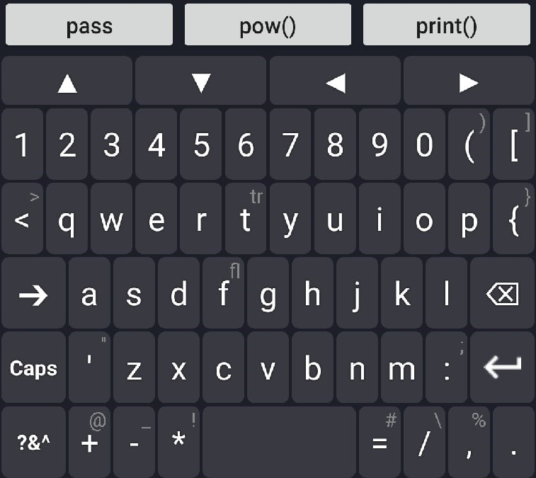
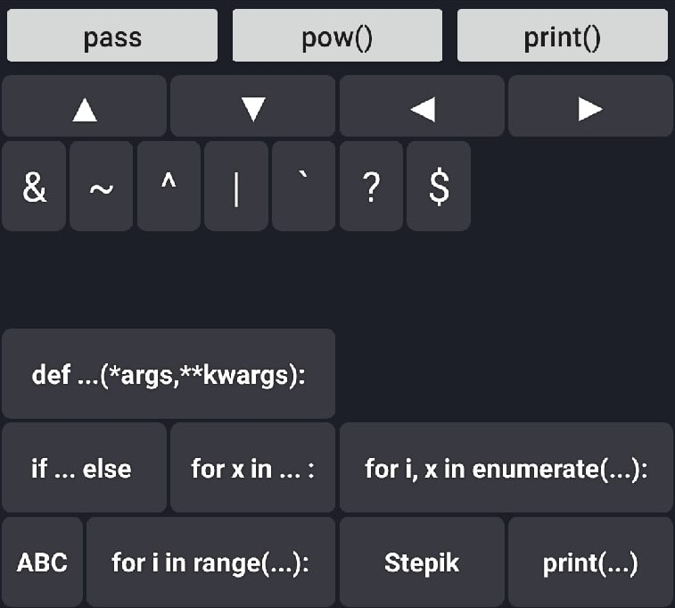
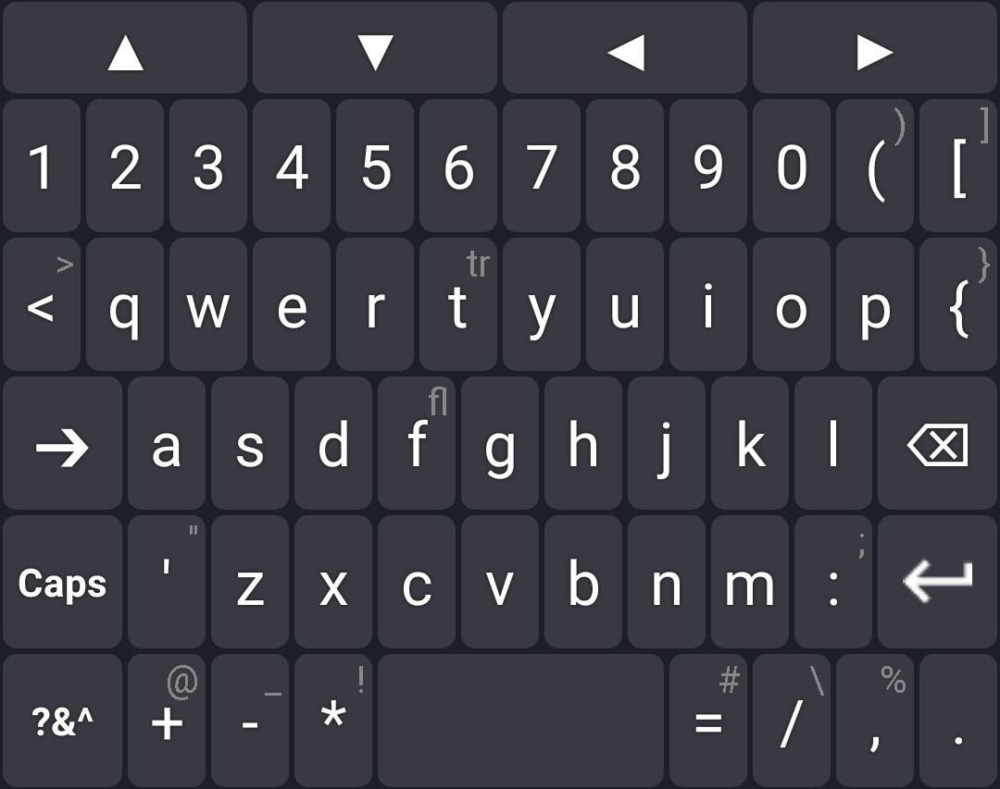
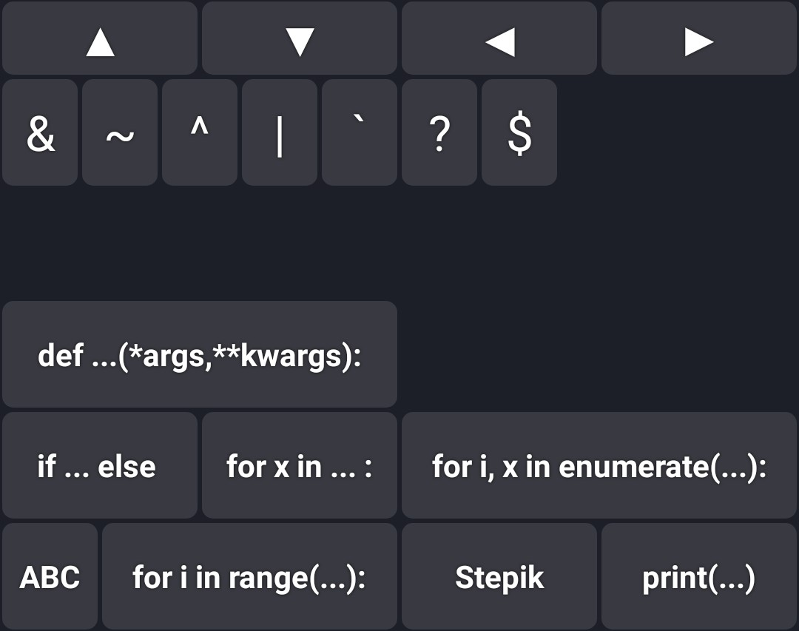
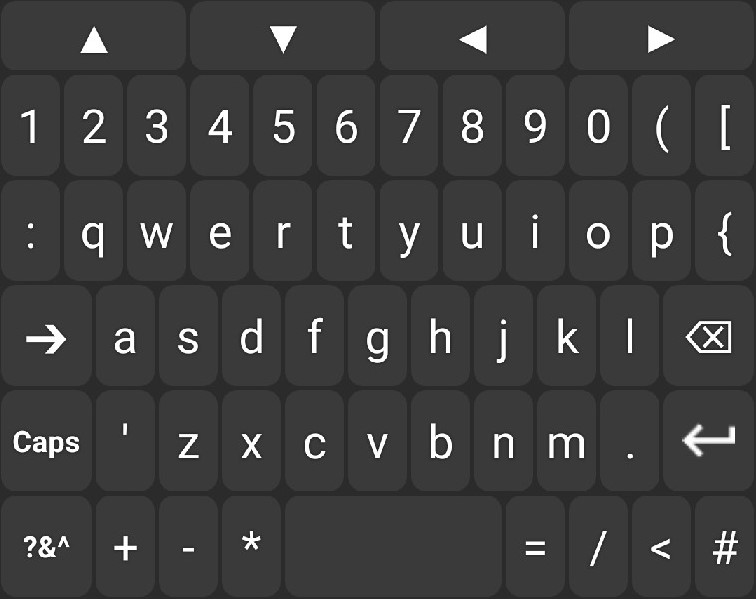
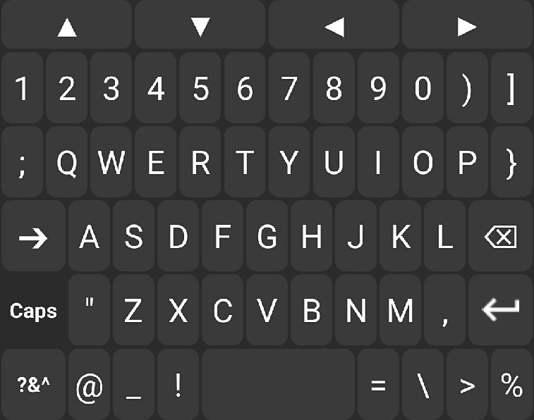
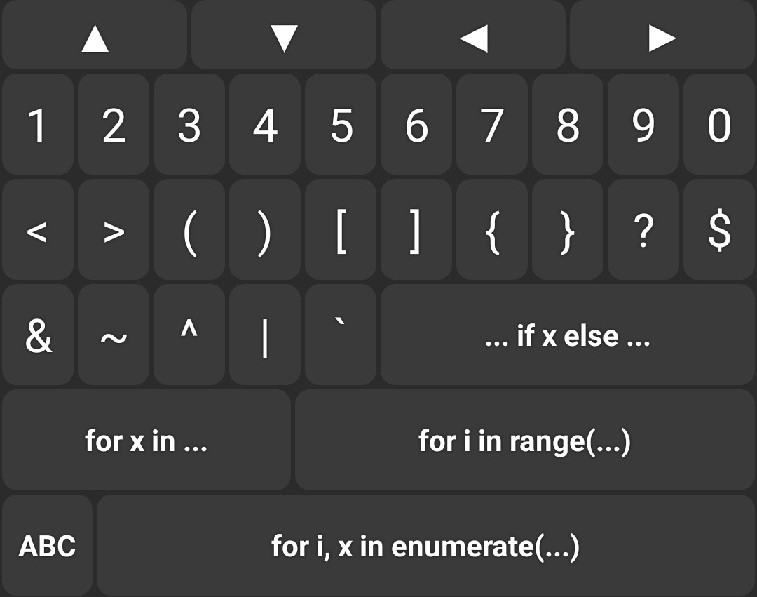
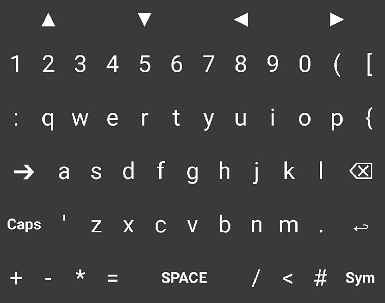
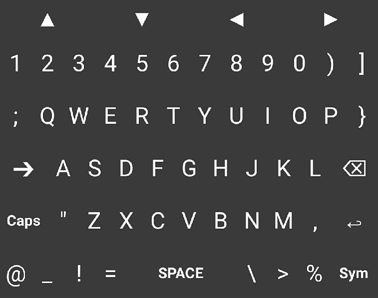
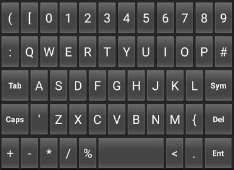

# PY Board v0.7

PY Board is a custom android keyboard for programming in Python

 

<a href="https://github.com/ringolol/PyBoard/raw/master/apk/PYB_07.apk">DOWNLOAD APK</a>

## Main features ##
* Easy access to symbols used in Python
* Navigation arrows
* Autocompletion for keywords, build-in functions and build-in constants
* Access second set of symbols by holding keys
* Snippets for __True__ and __False__, simply hold T or F 
* Code snippets

## How to install a new keyboard ##
<a href="https://www.androidcentral.com/how-set-default-keyboard-your-android-phone">Quick guide</a>

## ToDo ##
* More code snippets and symbols for symbols panel
* Add customatization through linked app
  * Light and dark themes
  * Custom code snippets
  * Show/Hide navigation arrows
  
## Known problems ##
* This app uses recently depricated classes Keyboard and KeyboardView

## Previous versions ##

### PYB v0.6 ###

 

### PYB v0.5 ###

 

### PYB v0.2 ###
   

### PYB v0.1 ###

