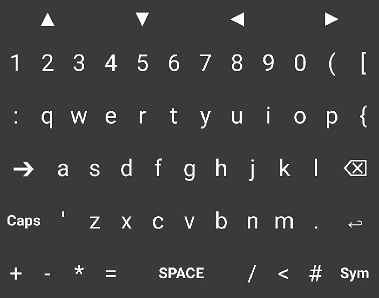
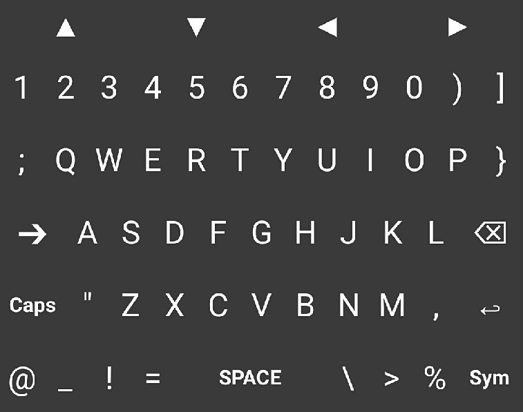
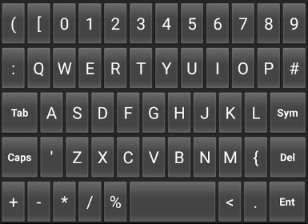

# PyBoard v0.2

PyBoard is a custom android keyboard for programming in Python

   

## Main features ##
* All key symbols can be accessed from main view
* Use Caps to access second set of special symbols
* Navigation arrows

## ToDo ##
* On long hold key -- access second set of special symbols
* On long hold key -- shortcuts, for example
  *  hold 'F' → __False__
  *  hold 'T' → __True__
* Add panel Sym
  * Add rarly used symbols to Sym
  * Add code snipets to Sym
* Add icons for functional buttons
* Create custom KeyboardView and Keyboard classes

## Previous versions ##

### PyBoard v0.1 ###

